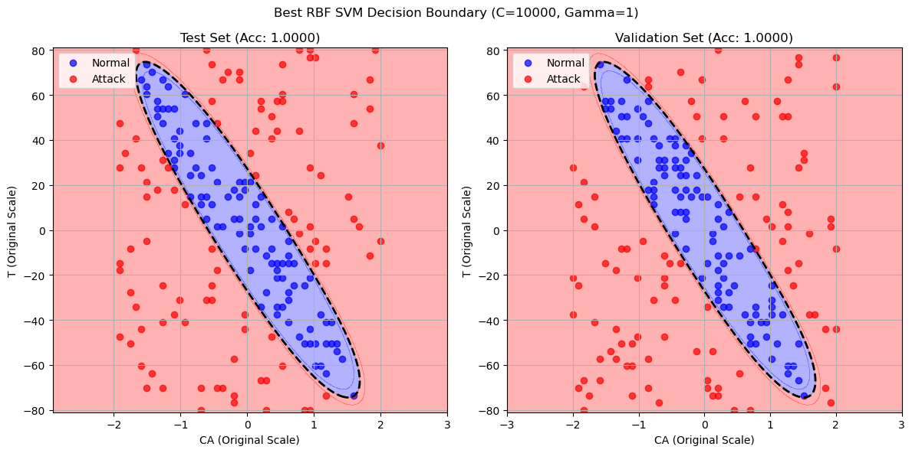

# CSTR_cyberattack

Classifying cyber attack on a stirred tank reactor using Support Vector Machine classifiers

Conducted hyperparameter tuning on a Radial Basis Function model that classifies cyber attacks with a 100% accuracy

